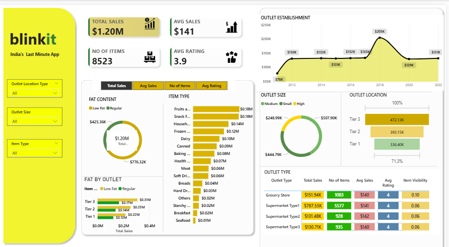

# 🛒 Blinkit Sales Dashboard | Power BI

<p align="center">
  
</p>

<p align="center">


</p>

---

# 📌 Project Overview

This project showcases an interactive **Business Intelligence Dashboard** developed in **Power BI** using the Blinkit Grocery Sales dataset.

The dashboard transforms raw transactional data into actionable business insights, enabling stakeholders to monitor sales performance, evaluate outlet efficiency, analyze customer preferences and support data-driven decision making.

---

# 🎯 Business Objective

The objective of this dashboard is to help business users answer critical business questions, including:

- Which outlet type generates the highest revenue?
- Which outlet size performs best?
- Which product categories contribute the most sales?
- Which locations deliver maximum business value?
- How does customer rating influence sales performance?
- Which products should receive higher inventory focus?

---

# 🛠 Technology Stack

| Technology | Purpose |
|------------|----------|
| **Power BI** | Dashboard Development |
| **Power Query** | Data Cleaning & Transformation |
| **DAX** | KPI & Business Calculations |
| **Excel** | Source Dataset |
| **Data Modeling** | Relationship Management |

---

# 📊 Dashboard Features

- Executive KPI Dashboard
- Dynamic Slicers & Filters
- Interactive Visualizations
- Outlet Performance Analysis
- Sales Trend Analysis
- Product Category Analysis
- Fat Content Analysis
- Outlet Size Analysis
- Outlet Location Analysis
- Business KPI Cards

---

# 📈 Key Performance Indicators

| KPI | Value |
|------|-------:|
| 💰 Total Sales | **$1.20M** |
| 📦 Total Items | **8,523** |
| 💵 Average Sales | **$141** |
| ⭐ Average Rating | **3.9** |

---

# 📷 Dashboard Preview

<p align="center">

</p>

---

# 📌 Business Insights

### 🏪 Outlet Performance

- Tier 3 outlets generated the highest overall revenue.
- Supermarket Type 1 contributed the maximum sales.
- Medium-sized outlets delivered the best sales performance.

### 🥦 Product Analysis

- Regular Fat products generated higher revenue than Low Fat products.
- Fruits & Vegetables and Snack Foods were the highest-selling product categories.

### 📈 Sales Trends

- Outlet establishment growth increased significantly after 2017.
- Customer ratings remained consistently high across outlet types.

---

# 🚀 Skills Demonstrated

- Business Intelligence
- Dashboard Development
- Data Visualization
- Power BI
- DAX
- Power Query
- Data Cleaning
- Data Transformation
- Data Modeling
- KPI Development
- Business Analytics
- Interactive Reporting

---

# 📂 Repository Structure

```
Blinkit-Sales-Dashboard
│
├── Blinkit-Sales-Dashboard.pbix
├── BlinkIT Grocery Data.xlsx
├── dashboard-preview.png
└── README.md
```

---

# 🎯 Business Value

This dashboard enables business stakeholders to:

- Monitor business performance in real time
- Identify high-performing outlet types
- Track product category performance
- Improve inventory planning
- Support strategic business decisions through interactive reporting

---

# 🔮 Future Enhancements

- Sales Forecasting using Time Series Analysis
- Customer Segmentation
- Profitability Dashboard
- Inventory Optimization
- Supplier Performance Analysis

---

# 👨‍💻 Author

## Chirag Kapoor

**Data Analyst**

📧 Email: kapoorchirag902@gmail.com

💼 LinkedIn: https://linkedin.com/in/chirag-kapoor-da

💻 GitHub: https://github.com/chiragk2

---

## ⭐ If you found this project helpful, consider giving it a Star.
